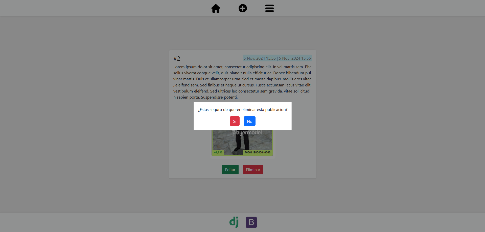

# Blog APP

Esta aplicación web de blogs permite a los usuarios registrados crear, editar y eliminar sus propias publicaciones. Los usuarios pueden modificar su nombre de usuario y contraseña en la sección de *Mi cuenta*, además, tienen la opción de eliminar su cuenta si así lo desean. También pueden guardar las publicaciones de otros usuarios en la sección de *Guardados* y acceder a ellas en cualquier momento.

<hr style="margin: 20px 0;" />

<div style="text-align: center;">
    
    
    
    
    
</div>

<hr style="margin-top: 15px;" />

### Caracteristicas y funcionalidades:
  * Diseño responsive.
  * Sistema de archivos para guardar imagenes.
  * Creacion, edicion y eliminacion de publicaciones.
  * Registro e inicio de sesion para los usuarios.
  * Cambio de nombre y contraseña.
  * Guardar publicaciones de cualquier usuario sin recargar la pagina con fetch.
  * Eliminacion de la cuenta del usuario y todos sus registros relacionados.
  
<hr style="margin: 20px 0;" />

### Instalacion:
   1. Instalar python

   2. ```python -m venv venv```

   3. ```venv\Scripts\activate``` o ```venv\Scripts\activate.bat```

   4. ```pip install -r requirements.txt```
   
   5. ```python manage.py migrate```

   6. ```python manage.py runserver```
   

<hr style="margin: 20px 0;" />

### Capturas




---
### Contacto:

<div style="text-align: center;">
    <a href="https://discord.com/users/7428">
        
    </a>
    <a href="mailto:nardellidavid611@gmail.com">
        
    </a>
</div>


